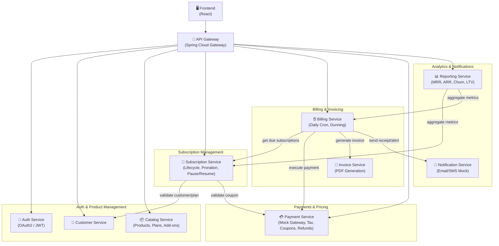
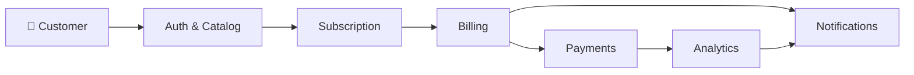
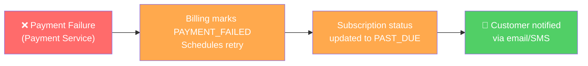

# Subscription Billing & Revenue Management System

A full-featured subscription billing engine that automates recurring billing for SaaS and streaming-style products. Built with a microservices architecture using Spring Boot, Spring Security, and MySQL.

The system handles the complete subscription lifecycle — from plan selection and onboarding through automated billing, payment processing, dunning recovery, and revenue analytics.

---

## Table of Contents

- [Features](#features)
- [System Architecture](#system-architecture)
- [Tech Stack](#tech-stack)
- [Modules Overview](#modules-overview)
- [Database Schema](#database-schema)
- [API Endpoints](#api-endpoints)
- [Key Workflows](#key-workflows)
- [Authentication & Authorization](#authentication--authorization)
- [Environment Setup](#environment-setup)
- [Project Structure](#project-structure)
- [Non-Functional Requirements](#non-functional-requirements)
- [License](#license)

---

## Features

### Core Billing Engine
- **Automated Recurring Billing** — Daily cron job detects subscriptions due for renewal, generates invoices, and triggers payment attempts
- **Idempotent Processing** — Duplicate billing attempts are prevented using idempotency keys, ensuring no customer is charged twice
- **Multi-Currency Support** — Price books per currency (INR, USD, EUR) with ISO-4217 compliance

### Subscription Lifecycle
- **State Machine** — Full lifecycle management: `DRAFT → TRIALING → ACTIVE → PAST_DUE → PAUSED → CANCELED`
- **Mid-Cycle Plan Changes** — Upgrade or downgrade plans with automatic proration based on remaining days
- **Pause & Resume** — Temporarily pause subscriptions with configurable auto-resume dates
- **Trial Management** — Configurable trial periods per plan with automatic activation on trial end

### Payment Processing
- **Mock Payment Gateway** — Simulated payment processing with realistic success/failure scenarios
- **Payment Tokenization** — Secure token-based storage; raw card numbers are never stored
- **Idempotent Charges** — Same idempotency key always returns the same result, preventing duplicate charges

### Dunning & Revenue Recovery
- **Configurable Retry Schedule** — Automatic retries on payment failure (e.g., after 1 day, 3 days, 7 days)
- **Dunning State Machine** — Tracks retry attempts: `PENDING → IN_PROGRESS → RESOLVED / EXHAUSTED`
- **Automated Customer Notifications** — "Update your card" reminders after each failed retry
- **Configurable End Action** — Cancel subscription or put on hold after all retries are exhausted

### Tax & Discount Engine
- **Region-Based Taxation** — GST, VAT, and custom tax rules per region
- **Inclusive & Exclusive Tax Modes** — Supports both tax-inclusive and tax-exclusive pricing
- **Coupon Engine** — Percentage and fixed-amount coupons with duration control (once, repeating, forever), expiry dates, and usage limits
- **Real-Time Validation** — Coupon applicability checked at checkout with dynamic total updates

### Invoicing
- **Automated Invoice Generation** — Invoices with itemized line items, taxes, discounts, and totals
- **PDF Export** — Downloadable PDF invoices with company header, customer details, and payment status
- **Credit Notes** — Automatically generated on refund processing, linked to original invoice
- **Invoice Statuses** — `DRAFT → FINALIZED → PAID → VOID`

### Revenue Analytics
- **KPI Dashboard** — Real-time metrics: MRR, ARR, ARPU, Gross Churn, Net Churn, LTV, DSO
- **Daily Snapshots** — Automated daily metric capture for historical trend analysis
- **Filterable Reports** — Filter by time range, plan, and region
- **Export** — CSV and PDF export for financial reporting

### Notifications
- **Template-Based Alerts** — Renewal reminders, payment receipts, failure notifications, cancellation notices
- **Multi-Channel** — Mock Email (SMTP) and SMS delivery
- **Configurable Reminders** — Renewal reminders at T-7 and T-1 days before billing (configurable)
- **Customer Preferences** — Opt-in/opt-out toggles; mandatory transactional alerts cannot be disabled

### Audit & Compliance
- **Immutable Audit Log** — Every monetary action (refunds, plan changes, cancellations) is logged with actor, action, old/new values, and timestamp
- **Append-Only** — Audit records cannot be edited or deleted
- **Traceable** — Correlation ID and request ID in every log entry for end-to-end tracing

---

## System Architecture



### Architecture Principles

- **Domain-Driven Design** — Each module owns its database tables, business logic, and API endpoints
- **No Cross-Domain DB Access** — Modules communicate exclusively via REST APIs; direct table queries across modules are prohibited
- **API-First Development** — API contracts (Swagger/OpenAPI) are defined before implementation begins
- **Modular Monolith** — Logically designed as microservices with clean module boundaries, implemented as a modular monolith to reduce deployment complexity

### Data Flow



### Failure Propagation



---

## Tech Stack

| Layer | Technology |
|---|---|
| **Backend** | Java 17+, Spring Boot, Spring Data JPA, Spring REST |
| **Security** | Spring Security, OAuth2, JWT (JSON Web Tokens) |
| **Gateway** | Spring Cloud Gateway |
| **Database** | MySQL |
| **Scheduling** | Spring `@Scheduled` (Cron Jobs) |
| **PDF Generation** | iText / Apache PDFBox |
| **Frontend** | React, TypeScript, HTML5, CSS3, Bootstrap |
| **Charts** | Chart.js / Recharts |
| **API Documentation** | Swagger / OpenAPI 3.0 |
| **Build Tool** | Maven |
| **Testing** | JUnit 5, Mockito |
| **Resilience** | Resilience4j (Circuit Breakers) |

---

## Modules Overview

### 1. Auth & Product Management

Handles authentication, authorization, customer profiles, and the product catalog.

| Component | Responsibility |
|---|---|
| **Auth Service** | OAuth2/JWT login, token refresh, role validation |
| **Customer Service** | Customer CRUD, profile management, search |
| **Catalog Service** | Product, Plan, Add-on, and Price Book management |
| **API Gateway** | Request routing, authentication filter, rate limiting |

**Roles Managed:** `ADMIN`, `FINANCE`, `SUPPORT`, `CUSTOMER`

---

### 2. Subscription Management

Manages the complete subscription lifecycle, including state transitions, proration, and pause/resume.

| Feature | Description |
|---|---|
| **State Machine** | `DRAFT → TRIALING → ACTIVE → PAST_DUE → PAUSED → CANCELED` |
| **Proration** | Credit/debit calculation based on remaining days when switching plans mid-cycle |
| **Multi-Subscription** | A single customer can hold multiple active subscriptions |
| **Subscription Items** | Base plan + add-ons tracked as individual line items |

---

### 3. Billing & Invoicing

Runs the automated billing engine, generates invoices, manages dunning, and produces PDF exports.

| Feature | Description |
|---|---|
| **Daily Cron** | Detects subscriptions due for renewal within 24 hours |
| **Invoice Engine** | Generates invoices with line items, taxes, discounts, and totals |
| **Dunning** | Retry schedule (1d, 3d, 7d) with automatic escalation |
| **PDF Export** | Formatted invoice download with complete billing details |
| **Idempotency** | Prevents duplicate invoice generation for the same billing period |

---

### 4. Payments & Pricing

Handles payment processing, tax calculation, coupon validation, and refunds.

| Feature | Description |
|---|---|
| **Mock Gateway** | Simulated payment processing (80% success / 20% failure for testing) |
| **Tokenization** | Payment methods stored as tokens; PCI-compliant design |
| **Tax Engine** | Region-based GST/VAT with inclusive/exclusive modes |
| **Coupon Engine** | Percentage/fixed coupons with duration, expiry, and usage limits |
| **Refunds** | Full and partial refunds with automatic credit note generation |

---

### 5. Analytics & Notifications

Provides revenue dashboards, notification delivery, and audit logging.

| Feature | Description |
|---|---|
| **Revenue KPIs** | MRR, ARR, ARPU, Gross/Net Churn, LTV, DSO |
| **Daily Snapshots** | Automated daily metric capture |
| **Notifications** | Template-based Email/SMS (mocked) with preference management |
| **Audit Log** | Immutable, append-only log of all monetary actions |
| **Export** | CSV and PDF report generation |

---

## Database Schema

All monetary amounts are stored in **minor units** (paise for INR, cents for USD). Currency follows ISO-4217. All timestamps are stored in UTC.

### Entity Relationship Overview

**18 tables** organized across 5 modules:

```
┌─────────────────────────────────────────────────────────┐
│                    AUTH & CATALOG                       │
│  User, Customer, Product, Plan, AddOn                   │
└────────────────────────┬────────────────────────────────┘
                         │
                         ▼
┌─────────────────────────────────────────────────────────┐
│                 SUBSCRIPTION                            │
│  Subscription, SubscriptionItem, PaymentMethod          │
└────────────────────────┬────────────────────────────────┘
                         │
                         ▼
┌─────────────────────────────────────────────────────────┐
│                BILLING & INVOICING                      │
│  Invoice, InvoiceLineItem, CreditNote, DunningSchedule  │
└────────────────────────┬────────────────────────────────┘
                         │
                         ▼
┌─────────────────────────────────────────────────────────┐
│               PAYMENTS & PRICING                        │
│  Payment, TaxRate, Coupon                               │
└────────────────────────┬────────────────────────────────┘
                         │
                         ▼
┌─────────────────────────────────────────────────────────┐
│            ANALYTICS & NOTIFICATIONS                    │
│  AuditLog, Notification, RevenueSnapshot                │
└─────────────────────────────────────────────────────────┘
```

### Table Definitions

<details>
<summary><strong>User</strong> — Login credentials and role assignments</summary>

| Column | Type | Constraints |
|---|---|---|
| id | BIGINT | PK, AUTO_INCREMENT |
| email | VARCHAR(255) | UNIQUE, NOT NULL |
| password_hash | VARCHAR(255) | NOT NULL |
| role | ENUM(ADMIN, FINANCE, SUPPORT, CUSTOMER) | NOT NULL |
| is_active | BOOLEAN | DEFAULT TRUE |
| created_at | TIMESTAMP | NOT NULL |
| updated_at | TIMESTAMP | NOT NULL |

</details>

<details>
<summary><strong>Customer</strong> — Customer profile information</summary>

| Column | Type | Constraints |
|---|---|---|
| id | BIGINT | PK, AUTO_INCREMENT |
| name | VARCHAR(255) | NOT NULL |
| email | VARCHAR(255) | UNIQUE, NOT NULL |
| phone | VARCHAR(20) | NULLABLE |
| currency | VARCHAR(3) | NOT NULL |
| address | TEXT | NULLABLE |
| region | VARCHAR(50) | NULLABLE |
| status | ENUM(ACTIVE, INACTIVE, SUSPENDED) | NOT NULL |
| created_at | TIMESTAMP | NOT NULL |
| updated_at | TIMESTAMP | NOT NULL |

</details>

<details>
<summary><strong>Product</strong> — Top-level catalog item</summary>

| Column | Type | Constraints |
|---|---|---|
| id | BIGINT | PK, AUTO_INCREMENT |
| name | VARCHAR(255) | NOT NULL |
| description | TEXT | NULLABLE |
| status | ENUM(ACTIVE, ARCHIVED) | NOT NULL |
| created_at | TIMESTAMP | NOT NULL |
| updated_at | TIMESTAMP | NOT NULL |

</details>

<details>
<summary><strong>Plan</strong> — Pricing tier under a product</summary>

| Column | Type | Constraints |
|---|---|---|
| id | BIGINT | PK, AUTO_INCREMENT |
| product_id | BIGINT | FK → Product(id) |
| name | VARCHAR(255) | NOT NULL |
| billing_period | ENUM(MONTHLY, YEARLY) | NOT NULL |
| price_minor | BIGINT | NOT NULL |
| currency | VARCHAR(3) | NOT NULL |
| trial_days | INT | DEFAULT 0 |
| setup_fee_minor | BIGINT | DEFAULT 0 |
| tax_mode | ENUM(INCLUSIVE, EXCLUSIVE) | NOT NULL |
| proration_mode | ENUM(PRORATED, FULL_CYCLE) | DEFAULT PRORATED |
| effective_from | DATE | NOT NULL |
| effective_to | DATE | NULLABLE |
| status | ENUM(ACTIVE, INACTIVE) | NOT NULL |
| created_at | TIMESTAMP | NOT NULL |
| updated_at | TIMESTAMP | NOT NULL |

</details>

<details>
<summary><strong>AddOn</strong> — Optional extras for plans</summary>

| Column | Type | Constraints |
|---|---|---|
| id | BIGINT | PK, AUTO_INCREMENT |
| product_id | BIGINT | FK → Product(id) |
| name | VARCHAR(255) | NOT NULL |
| price_minor | BIGINT | NOT NULL |
| currency | VARCHAR(3) | NOT NULL |
| billing_period | ENUM(MONTHLY, YEARLY) | NOT NULL |
| status | ENUM(ACTIVE, INACTIVE) | NOT NULL |
| created_at | TIMESTAMP | NOT NULL |

</details>

<details>
<summary><strong>Subscription</strong> — Active customer-plan relationship</summary>

| Column | Type | Constraints |
|---|---|---|
| id | BIGINT | PK, AUTO_INCREMENT |
| customer_id | BIGINT | FK → Customer(id) |
| plan_id | BIGINT | FK → Plan(id) |
| status | ENUM(DRAFT, TRIALING, ACTIVE, PAST_DUE, PAUSED, CANCELED) | NOT NULL |
| start_date | DATE | NOT NULL |
| current_period_start | DATE | NOT NULL |
| current_period_end | DATE | NOT NULL |
| cancel_at_period_end | BOOLEAN | DEFAULT FALSE |
| paused_from | DATE | NULLABLE |
| paused_to | DATE | NULLABLE |
| payment_method_id | BIGINT | FK → PaymentMethod(id) |
| currency | VARCHAR(3) | NOT NULL |
| created_at | TIMESTAMP | NOT NULL |
| updated_at | TIMESTAMP | NOT NULL |

</details>

<details>
<summary><strong>SubscriptionItem</strong> — Line items within a subscription</summary>

| Column | Type | Constraints |
|---|---|---|
| id | BIGINT | PK, AUTO_INCREMENT |
| subscription_id | BIGINT | FK → Subscription(id) |
| item_type | ENUM(BASE_PLAN, ADD_ON) | NOT NULL |
| reference_id | BIGINT | NOT NULL |
| unit_price_minor | BIGINT | NOT NULL |
| quantity | INT | DEFAULT 1 |
| tax_mode | ENUM(INCLUSIVE, EXCLUSIVE) | NOT NULL |
| discount_id | BIGINT | FK → Coupon(id), NULLABLE |
| created_at | TIMESTAMP | NOT NULL |

</details>

<details>
<summary><strong>PaymentMethod</strong> — Tokenized payment methods</summary>

| Column | Type | Constraints |
|---|---|---|
| id | BIGINT | PK, AUTO_INCREMENT |
| customer_id | BIGINT | FK → Customer(id) |
| token | VARCHAR(255) | NOT NULL |
| card_last_four | VARCHAR(4) | NOT NULL |
| card_brand | VARCHAR(20) | NOT NULL |
| expiry_month | INT | NOT NULL |
| expiry_year | INT | NOT NULL |
| is_default | BOOLEAN | DEFAULT FALSE |
| created_at | TIMESTAMP | NOT NULL |

</details>

<details>
<summary><strong>Invoice</strong> — Generated bill for a billing period</summary>

| Column | Type | Constraints |
|---|---|---|
| id | BIGINT | PK, AUTO_INCREMENT |
| invoice_number | VARCHAR(50) | UNIQUE, NOT NULL |
| customer_id | BIGINT | FK → Customer(id) |
| subscription_id | BIGINT | FK → Subscription(id) |
| status | ENUM(DRAFT, FINALIZED, PAID, VOID, PAYMENT_FAILED) | NOT NULL |
| issue_date | DATE | NOT NULL |
| due_date | DATE | NOT NULL |
| subtotal_minor | BIGINT | NOT NULL |
| tax_minor | BIGINT | NOT NULL |
| discount_minor | BIGINT | DEFAULT 0 |
| total_minor | BIGINT | NOT NULL |
| balance_minor | BIGINT | NOT NULL |
| currency | VARCHAR(3) | NOT NULL |
| idempotency_key | VARCHAR(255) | UNIQUE, NULLABLE |
| created_at | TIMESTAMP | NOT NULL |
| updated_at | TIMESTAMP | NOT NULL |

</details>

<details>
<summary><strong>InvoiceLineItem</strong> — Individual charges on an invoice</summary>

| Column | Type | Constraints |
|---|---|---|
| id | BIGINT | PK, AUTO_INCREMENT |
| invoice_id | BIGINT | FK → Invoice(id) |
| description | VARCHAR(500) | NOT NULL |
| quantity | INT | DEFAULT 1 |
| unit_price_minor | BIGINT | NOT NULL |
| amount_minor | BIGINT | NOT NULL |
| tax_rate_id | BIGINT | FK → TaxRate(id), NULLABLE |
| discount_id | BIGINT | FK → Coupon(id), NULLABLE |
| line_type | ENUM(CHARGE, CREDIT, PRORATION) | DEFAULT CHARGE |
| metadata | TEXT | NULLABLE |
| created_at | TIMESTAMP | NOT NULL |

</details>

<details>
<summary><strong>Payment</strong> — Payment attempt record</summary>

| Column | Type | Constraints |
|---|---|---|
| id | BIGINT | PK, AUTO_INCREMENT |
| invoice_id | BIGINT | FK → Invoice(id) |
| payment_method_id | BIGINT | FK → PaymentMethod(id) |
| gateway_ref | VARCHAR(255) | NULLABLE |
| amount_minor | BIGINT | NOT NULL |
| currency | VARCHAR(3) | NOT NULL |
| status | ENUM(PENDING, SUCCEEDED, FAILED, REFUNDED) | NOT NULL |
| attempt_no | INT | NOT NULL |
| response_code | VARCHAR(10) | NULLABLE |
| idempotency_key | VARCHAR(255) | UNIQUE, NOT NULL |
| created_at | TIMESTAMP | NOT NULL |

</details>

<details>
<summary><strong>TaxRate</strong> — Region-based tax rules</summary>

| Column | Type | Constraints |
|---|---|---|
| id | BIGINT | PK, AUTO_INCREMENT |
| region | VARCHAR(50) | NOT NULL |
| name | VARCHAR(100) | NOT NULL |
| rate_percent | INT | NOT NULL |
| inclusive | BOOLEAN | NOT NULL |
| effective_from | DATE | NOT NULL |
| effective_to | DATE | NULLABLE |
| created_at | TIMESTAMP | NOT NULL |

</details>

<details>
<summary><strong>Coupon</strong> — Discount codes</summary>

| Column | Type | Constraints |
|---|---|---|
| id | BIGINT | PK, AUTO_INCREMENT |
| code | VARCHAR(50) | UNIQUE, NOT NULL |
| type | ENUM(PERCENT, FIXED) | NOT NULL |
| amount | BIGINT | NOT NULL |
| duration | ENUM(ONCE, REPEATING, FOREVER) | NOT NULL |
| duration_in_months | INT | NULLABLE |
| max_redemptions | INT | NULLABLE |
| redeemed_count | INT | DEFAULT 0 |
| valid_from | DATE | NOT NULL |
| valid_to | DATE | NULLABLE |
| status | ENUM(ACTIVE, EXPIRED, DISABLED) | NOT NULL |
| created_at | TIMESTAMP | NOT NULL |

</details>

<details>
<summary><strong>CreditNote</strong> — Refund documentation</summary>

| Column | Type | Constraints |
|---|---|---|
| id | BIGINT | PK, AUTO_INCREMENT |
| credit_note_no | VARCHAR(50) | UNIQUE, NOT NULL |
| invoice_id | BIGINT | FK → Invoice(id) |
| reason | VARCHAR(500) | NOT NULL |
| amount_minor | BIGINT | NOT NULL |
| type | ENUM(REFUND, ADJUSTMENT, PRORATION_CREDIT) | DEFAULT REFUND |
| created_by | VARCHAR(255) | NOT NULL |
| created_at | TIMESTAMP | NOT NULL |

</details>

<details>
<summary><strong>DunningSchedule</strong> — Retry tracking for failed payments</summary>

| Column | Type | Constraints |
|---|---|---|
| id | BIGINT | PK, AUTO_INCREMENT |
| invoice_id | BIGINT | FK → Invoice(id) |
| subscription_id | BIGINT | FK → Subscription(id) |
| attempt_count | INT | DEFAULT 0 |
| max_attempts | INT | DEFAULT 3 |
| next_retry_date | DATE | NOT NULL |
| status | ENUM(PENDING, IN_PROGRESS, RESOLVED, EXHAUSTED) | NOT NULL |
| last_attempted | TIMESTAMP | NULLABLE |
| created_at | TIMESTAMP | NOT NULL |
| updated_at | TIMESTAMP | NOT NULL |

</details>

<details>
<summary><strong>AuditLog</strong> — Immutable action log</summary>

| Column | Type | Constraints |
|---|---|---|
| id | BIGINT | PK, AUTO_INCREMENT |
| actor | VARCHAR(255) | NOT NULL |
| action | VARCHAR(100) | NOT NULL |
| entity_type | VARCHAR(100) | NOT NULL |
| entity_id | BIGINT | NOT NULL |
| old_value | TEXT | NULLABLE |
| new_value | TEXT | NULLABLE |
| request_id | VARCHAR(255) | NULLABLE |
| ip_address | VARCHAR(50) | NULLABLE |
| created_at | TIMESTAMP | NOT NULL |

</details>

<details>
<summary><strong>Notification</strong> — Notification delivery log</summary>

| Column | Type | Constraints |
|---|---|---|
| id | BIGINT | PK, AUTO_INCREMENT |
| customer_id | BIGINT | FK → Customer(id) |
| type | VARCHAR(50) | NOT NULL |
| subject | VARCHAR(255) | NOT NULL |
| body | TEXT | NULLABLE |
| channel | ENUM(EMAIL, SMS) | NOT NULL |
| status | ENUM(SENT, FAILED, SKIPPED) | NOT NULL |
| reference_id | BIGINT | NULLABLE |
| sent_at | TIMESTAMP | NULLABLE |
| created_at | TIMESTAMP | NOT NULL |

</details>

<details>
<summary><strong>RevenueSnapshot</strong> — Daily KPI snapshot</summary>

| Column | Type | Constraints |
|---|---|---|
| id | BIGINT | PK, AUTO_INCREMENT |
| snapshot_date | DATE | UNIQUE, NOT NULL |
| mrr_minor | BIGINT | NOT NULL |
| arr_minor | BIGINT | NOT NULL |
| arpu_minor | BIGINT | NOT NULL |
| active_customers | INT | NOT NULL |
| new_customers | INT | DEFAULT 0 |
| churned_customers | INT | DEFAULT 0 |
| gross_churn_percent | DECIMAL | NOT NULL |
| net_churn_percent | DECIMAL | NOT NULL |
| ltv_minor | BIGINT | DEFAULT 0 |
| total_revenue_minor | BIGINT | NOT NULL |
| total_refunds_minor | BIGINT | DEFAULT 0 |
| created_at | TIMESTAMP | NOT NULL |

</details>

### Key Relationships

```
Product ──(1:N)──▶ Plan
Product ──(1:N)──▶ AddOn

Customer ──(1:N)──▶ Subscription
Customer ──(1:N)──▶ PaymentMethod
Customer ──(1:N)──▶ Invoice
Customer ──(1:N)──▶ Notification

Subscription ──(N:1)──▶ Customer
Subscription ──(N:1)──▶ Plan
Subscription ──(1:1)──▶ PaymentMethod
Subscription ──(1:N)──▶ SubscriptionItem
Subscription ──(1:N)──▶ Invoice

Invoice ──(1:N)──▶ InvoiceLineItem
Invoice ──(1:N)──▶ Payment
Invoice ──(1:N)──▶ CreditNote
Invoice ──(0:1)──▶ DunningSchedule
```

---

## API Endpoints

Base URI: `/api/v1`

### Authentication
| Method | Endpoint | Description |
|---|---|---|
| POST | `/auth/login` | Authenticate user, returns JWT |
| POST | `/auth/refresh` | Refresh access token |

### Customers
| Method | Endpoint | Description |
|---|---|---|
| POST | `/customers` | Create a new customer |
| GET | `/customers/{id}` | Get customer by ID |
| GET | `/customers?email=&status=` | Search/filter customers |
| PUT | `/customers/{id}` | Update customer profile |
| DELETE | `/customers/{id}` | Soft delete customer |

### Product Catalog
| Method | Endpoint | Description |
|---|---|---|
| POST | `/products` | Create a product |
| GET | `/products` | List all products |
| POST | `/plans` | Create a plan under a product |
| GET | `/plans?productId=&currency=` | Filter plans |
| POST | `/addons` | Create an add-on |
| GET | `/addons` | List all add-ons |

### Subscriptions
| Method | Endpoint | Description |
|---|---|---|
| POST | `/subscriptions` | Create a new subscription |
| GET | `/subscriptions/{id}` | Get subscription details |
| PATCH | `/subscriptions/{id}` | Upgrade, downgrade, pause, or resume |
| POST | `/subscriptions/{id}/cancel` | Cancel subscription |
| GET | `/customers/{id}/subscriptions` | List customer's subscriptions |

### Billing & Invoices
| Method | Endpoint | Description |
|---|---|---|
| POST | `/billing/run` | Trigger billing cycle manually |
| GET | `/billing/jobs?status=` | List billing job statuses |
| GET | `/invoices?customerId=&status=` | List invoices with filters |
| GET | `/invoices/{id}` | Get invoice details |
| GET | `/invoices/{id}/pdf` | Download invoice as PDF |
| POST | `/invoices/{id}/finalize` | Finalize a draft invoice |
| POST | `/invoices/{id}/void` | Void an invoice |
| POST | `/invoices/{id}/pay` | Mark invoice as paid |
| POST | `/credit-notes` | Create a credit note |

### Payments
| Method | Endpoint | Description |
|---|---|---|
| POST | `/payments` | Process a payment |
| GET | `/payments/{id}` | Get payment details |
| POST | `/payments/{id}/refund` | Issue full or partial refund |

### Taxes & Coupons
| Method | Endpoint | Description |
|---|---|---|
| POST | `/tax-rates` | Create a tax rate |
| GET | `/tax-rates` | List tax rates |
| POST | `/coupons` | Create a coupon |
| GET | `/coupons` | List coupons |
| POST | `/coupons/validate` | Validate a coupon code |

### Analytics & Reports
| Method | Endpoint | Description |
|---|---|---|
| GET | `/reports/revenue?from=&to=&granularity=` | Revenue report |
| GET | `/reports/mrr?from=&to=` | MRR trend data |
| GET | `/reports/churn?from=&to=` | Churn rate data |
| GET | `/reports/export?format=csv&type=` | Export report |

### Audit & Notifications
| Method | Endpoint | Description |
|---|---|---|
| POST | `/audit-logs` | Create an audit log entry |
| GET | `/audit-logs?customerId=&action=&from=&to=` | Query audit logs |
| POST | `/notifications/send` | Send a notification |

### HTTP Status Codes

| Code | Usage |
|---|---|
| 200 | Success |
| 201 | Created |
| 202 | Accepted (async processing) |
| 400 | Bad Request (validation error) |
| 401 | Unauthorized (missing/invalid token) |
| 403 | Forbidden (insufficient role) |
| 404 | Not Found |
| 409 | Conflict (duplicate resource) |
| 422 | Unprocessable Entity |
| 429 | Too Many Requests |
| 500 | Internal Server Error |

### Standard Error Response

```json
{
  "timestamp": "2026-04-15T10:30:00Z",
  "requestId": "req_abc123",
  "errorCode": "COUPON_EXPIRED",
  "message": "The coupon code has expired",
  "details": ["Coupon valid_to was 2026-03-31"],
  "path": "/api/v1/coupons/validate"
}
```

---

## Key Workflows

### 1. Subscription Creation

```
Customer selects Plan + Add-ons
    │
    ▼
Validate coupon (if provided) ──▶ Coupon Service
    │
    ▼
Create Subscription (status: TRIALING or ACTIVE)
    │
    ├── Trial? ──▶ No charge, schedule activation
    │
    └── No trial? ──▶ Generate Invoice
                         │
                         ▼
                    Attempt Payment
                         │
                    ┌────┴────┐
                    │         │
                SUCCESS    FAILURE
                    │         │
                    ▼         ▼
               Invoice    Invoice = PAYMENT_FAILED
               = PAID     Schedule dunning retry
               Send       Send failure notification
               receipt
```

### 2. Daily Renewal Billing (Cron)

```
Cron Job (2:00 AM daily)
    │
    ▼
Find all active subscriptions expiring tomorrow
    │
    ▼
For each subscription:
    ├── Skip if PAUSED
    ├── Skip if already invoiced (idempotency)
    │
    ▼
Generate Invoice (line items + tax + discount)
    │
    ▼
Attempt Payment via Payment Service
    │
    ├── SUCCESS ──▶ Invoice = PAID, send receipt
    │
    └── FAILURE ──▶ Invoice = FAILED, enter dunning
```

### 3. Dunning & Retry

```
Payment Fails
    │
    ▼
Create DunningSchedule (attempt_count = 0)
    │
    ▼
Retry Schedule:
    Day 1:  Retry ──▶ Success? ──▶ RESOLVED
                  └──▶ Fail ──▶ Send "update card" email
    Day 3:  Retry ──▶ Success? ──▶ RESOLVED
                  └──▶ Fail ──▶ Send reminder
    Day 7:  Retry ──▶ Success? ──▶ RESOLVED
                  └──▶ Fail ──▶ EXHAUSTED
                                    │
                                    ▼
                              Cancel subscription
                              Send cancellation notice
```

### 4. Mid-Cycle Upgrade/Downgrade

```
Customer requests plan change
    │
    ▼
Calculate proration:
    Credit for unused days on old plan
    Charge for remaining days on new plan
    Net = Charge - Credit
    │
    ▼
Update Subscription (new plan_id)
    │
    ├── Charge immediately ──▶ Generate invoice now
    │
    └── Defer to next renewal ──▶ Add proration line
                                  to next invoice
```

---

## Authentication & Authorization

### JWT Flow

1. User sends credentials to `POST /auth/login`
2. Server validates and returns `accessToken` + `refreshToken`
3. Client includes `Authorization: Bearer <token>` on all requests
4. API Gateway validates token and extracts role
5. Each endpoint checks role-based permissions

### Role Permissions

| Resource | ADMIN | FINANCE | SUPPORT | CUSTOMER |
|---|:---:|:---:|:---:|:---:|
| Product/Plan CRUD | ✅ | ❌ | ❌ | ❌ |
| Customer Management | ✅ | ❌ | ✅ | Own only |
| Subscription Actions | ✅ | ❌ | ✅ | Own only |
| View Invoices | ✅ | ✅ | ✅ | Own only |
| Issue Refunds | ✅ | ❌ | ✅ | ❌ |
| Revenue Reports | ✅ | ✅ | ❌ | ❌ |
| Audit Logs | ✅ | ✅ | ❌ | ❌ |
| Coupon/Tax Management | ✅ | ❌ | ❌ | ❌ |

---

## Environment Setup

### Prerequisites

- Java 17+
- Maven 3.8+
- MySQL 8.0+
- Node.js 18+ (for frontend)

### Backend Setup

```bash
# Clone the repository
git clone https://github.com/<your-org>/subscription-billing.git
cd subscription-billing

# Configure database
mysql -u root -p -e "CREATE DATABASE subscription_billing;"

# Update application.yml with your DB credentials

# Build and run
mvn clean install
mvn spring-boot:run
```

### Frontend Setup

```bash
cd frontend
npm install
npm run dev
```

### Environment Variables

| Variable | Description | Default |
|---|---|---|
| `DB_HOST` | MySQL host | `localhost` |
| `DB_PORT` | MySQL port | `3306` |
| `DB_NAME` | Database name | `subscription_billing` |
| `DB_USER` | Database username | `root` |
| `DB_PASSWORD` | Database password | — |
| `JWT_SECRET` | JWT signing key | — |
| `JWT_EXPIRY_MS` | Token expiry in milliseconds | `3600000` |

---

## Project Structure

```
subscription-billing/
├── api-gateway/
│   └── src/main/java/.../gateway/
├── auth-service/
│   └── src/main/java/.../auth/
│       ├── controller/
│       ├── dto/
│       ├── entity/
│       ├── repository/
│       ├── service/
│       ├── config/
│       └── exception/
├── customer-service/
├── catalog-service/
├── subscription-service/
├── billing-service/
├── invoice-service/
├── payment-service/
├── reporting-service/
├── notification-service/
├── frontend/
│   ├── src/
│   │   ├── components/
│   │   ├── pages/
│   │   ├── services/
│   │   └── utils/
│   └── package.json
└── README.md
```

Each service follows the same internal structure:

```
{service-name}/
└── src/main/java/com/billing/{module}/
    ├── controller/    ← REST API endpoints
    ├── dto/           ← Request/Response objects
    ├── entity/        ← JPA entity classes
    ├── repository/    ← Spring Data JPA interfaces
    ├── service/       ← Business logic
    ├── config/        ← Module configuration
    └── exception/     ← Custom exceptions + handler
```

---

## Non-Functional Requirements

| Requirement | Target |
|---|---|
| **Test Coverage** | ≥ 80% (JUnit + Mockito) |
| **API Documentation** | Swagger/OpenAPI for every endpoint |
| **Input Validation** | Bean Validation (`@Valid`, `@NotNull`) on all inputs |
| **Error Handling** | Centralized via `@ControllerAdvice` per service |
| **Logging** | Structured JSON with `correlationId` and `requestId` |
| **Monetary Precision** | All amounts in minor units (paise/cents) |
| **Time Handling** | All internal timestamps in UTC |
| **Security** | BCrypt passwords, JWT tokens, RBAC enforcement |
| **Resilience** | Circuit breaker: 3s timeout, 50% error threshold, 60s open state |
| **Idempotency** | Payment and invoice creation protected by idempotency keys |

---

## License

This project is developed as an academic project for educational purposes.

---

<p align="center">
  <strong>Subscription Billing & Revenue Management System</strong><br>
  Built with Spring Boot · MySQL · React
</p>
